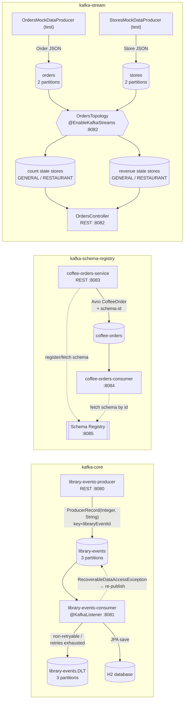

# Learning Kafka


## Table of contents

1. 🏗️ [Project Structure](#project-structure)
2. 📨 [Part 1 — Core Kafka Concepts](#part-1--core-kafka-concepts-grounded-in-this-codebase)
3. 📨 [Part 2 — Component & Message-Flow Diagrams](#part-2--component--message-flow-diagrams)
4. 🧰 [Tech Stack](#tech-stack)
5. 🏗️ [Gang of Four Design Patterns Applied](#gang-of-four-design-patterns-applied)
6. 🚀 [Quick Start](#quick-start)
7. 🌐 [API Reference — Library Events Producer](#api-reference--library-events-producer-port-8080)
8. 📈 [Observability](#observability)
9. 🧪 [Running Tests](#running-tests)
10. 🏗️ [Module Details](#module-details)

A multi-module Maven project demonstrating Apache Kafka with Spring Boot 3.5, Java 25, Confluent Schema Registry, and Kafka Streams. Unlike a toy "hello world," each module wires up the pieces you actually need in production: retryable consumers with dead-letter routing, Avro schema evolution against a real Schema Registry, and a stateful Kafka Streams topology with interactive queries.

This document is a **conceptual deep-dive** — it explains *why* Kafka is shaped the way it is, and then shows exactly where in this codebase each concept is implemented. For step-by-step run instructions specific to one module, see the per-module READMEs linked throughout.

---

<a id="project-structure"></a>
## 1. 🏗️ Project Structure

```
learning-kafka/                       ← root POM (spring-boot-starter-parent)
├── kafka-core/                       ← Kafka producer + consumer (README: kafka-core/README.md)
│   ├── library-events-producer/      ← REST API → Kafka (port 8080)
│   └── library-events-consumer/      ← Kafka → H2 database (port 8081)
├── kafka-stream/                     ← Kafka Streams (README: kafka-stream/README.md)
│   ├── orders-domain/                ← shared domain records (library JAR)
│   └── orders-streams-app/           ← order count & revenue topology (port 8082)
└── kafka-schema-registry/            ← Avro + Confluent Schema Registry (README: kafka-schema-registry/README.md)
    ├── schemas/                      ← Avro .avsc definitions + code generation
    ├── coffee-orders-service/        ← Avro producer (port 8083)
    └── coffee-orders-consumer/       ← Avro consumer (port 8084)
```

---

## Part 1 — Core Kafka Concepts, Grounded in This Codebase

Kafka is a distributed, append-only, partitioned commit log. Everything else — topics, consumer groups, delivery guarantees, Streams, Schema Registry — is built on top of that one idea. The sections below explain the core vocabulary and immediately point at the line of code in this repository that exercises it.

### Topics and partitions

A **topic** is a named, ordered, immutable log of records. Kafka splits a topic into **partitions** so it can be written to and read from in parallel across brokers. Every record appended to a partition gets a monotonically increasing **offset** — its position in that partition's log. Ordering is only guaranteed *within* a partition, never across partitions of the same topic.

This repo creates its topics programmatically with Spring Kafka's `TopicBuilder`, rather than relying on broker auto-create, so partition counts are explicit and version-controlled:

| Topic | Partitions | Declared in |
|---|---|---|
| `library-events` | 3 | `kafka-core/library-events-producer/.../config/AutoCreateConfig.java` |
| `library-events.DLT` | 3 | `kafka-core/library-events-consumer/.../config/LibraryEventsConsumerConfig.java` |
| `orders` | 2 | `kafka-stream/orders-streams-app/.../config/OrdersStreamsConfiguration.java` |
| `stores` | 2 | `kafka-stream/orders-streams-app/.../config/OrdersStreamsConfiguration.java` |
| `coffee-orders` | broker default | created implicitly on first produce by `coffee-orders-service` |

The **key** a producer assigns to a record determines which partition it lands on (`hash(key) % numPartitions`, by default). `LibraryEventProducer` keys every record by `libraryEventId` (an `Integer`); `OrdersTopology` re-keys the incoming order stream by `locationId` via `.selectKey((key, order) -> order.locationId())` specifically so that all orders for the same store land on the same partition — which is what makes per-store aggregation with a local state store possible (see Part 4).

### Offsets and consumer position

Kafka does not track "read" vs "unread" the way a queue does. Instead, each **consumer group** tracks a *committed offset* per partition — the position it will resume from after a restart or rebalance. The broker's `__consumer_offsets` internal topic stores this.

<ul>

- `library-events-consumer` runs with the **default auto-commit** behavior (Spring Kafka commits the offset for you after the listener method returns without throwing).
- `LibraryEventsConsumerManualOffset` (active only under the `manual-offset` profile) demonstrates the alternative: `AcknowledgingMessageListener` with `MANUAL_IMMEDIATE` ack mode, where the application explicitly calls `acknowledgment.acknowledge()` after it has finished processing. This is the safer pattern when "processed" and "committed" must not drift apart (e.g., commit only after a DB write succeeds).

</ul>

`auto-offset-reset: earliest` is set on both `library-events-consumer` and the streams app, meaning a *brand new* consumer group with no committed offset starts from the beginning of the topic rather than only seeing new records.

### Consumer groups and parallelism

A **consumer group** is a set of consumer instances that cooperatively read a topic — Kafka guarantees each partition is assigned to at most one consumer *within* the group at a time, so work is load-balanced without any two group members processing the same partition simultaneously. Add more consumers than partitions and the extras sit idle; that's why partition count is the real upper bound on consumer parallelism.

`LibraryEventsConsumerConfig.kafkaListenerContainerFactory()` sets `factory.setConcurrency(3)` — three listener threads inside the *same* JVM, matching the topic's 3 partitions one-for-one, so a single consumer instance can drain all partitions in parallel instead of serially.

### Delivery semantics: at-least-once, at-most-once, exactly-once

| Semantic | Guarantee | Cost |
|---|---|---|
| At-most-once | Each record delivered zero or one times | Commit offset *before* processing — a crash mid-processing loses the record |
| At-least-once | Each record delivered one or more times | Commit offset *after* processing — a crash before commit causes redelivery (must be idempotent) |
| Exactly-once (EOS) | Each record has effect exactly once | Requires idempotent producer + transactions across the read-process-write cycle |

This codebase is explicitly **at-least-once**:

<ul>

- `library-events-producer` sets `acks: all` (wait for all in-sync replicas) with `enable.idempotence: true` and `retries: 10` — this makes *producer-side* sends idempotent (no duplicate writes from producer retries) and durable, but does not make the end-to-end pipeline exactly-once.
- `library-events-consumer`'s default listener commits the offset only after `LibraryEventsService.processLibraryEvent()` returns successfully (implicit ack-after-processing). If the JVM crashes after the DB write but before the offset commit, the same record is redelivered on restart — the consumer must tolerate reprocessing (in this demo it isn't made strictly idempotent; a second `save()` of the same JPA entity is an upsert-by-id, which is *close* to idempotent by accident of using `@Id` on `libraryEventId`).
- Kafka Streams uses `processing.guarantee=at_least_once` by default (not overridden anywhere in `OrdersStreamsConfiguration`), so the count/revenue aggregations can, in rare failure-and-reprocessing scenarios, double-count a record. Enabling exactly-once semantics for the streams app would mean setting `processing.guarantee=exactly_once_v2`, which turns on transactional writes to the state-store changelog topics and the output topics together.

</ul>

### Retention, compaction, and the internal topics you don't see

Kafka retains records for a configured time/size window (topic retention), independent of whether they've been consumed — this is what lets Kafka Streams *replay* a topic from the beginning to rebuild a KTable on startup (see Part 4). Internal topics like `__consumer_offsets` and the Kafka Streams changelog topics (e.g. `<application-id>-<store-name>-changelog`) use **log compaction** instead of time-based retention: only the latest value per key is kept forever, because they represent current state, not an event history.

---

<a id="part-2--component--message-flow-diagrams"></a>
## 3. 📨 Part 2 — Component & Message-Flow Diagrams

### 2.1 System component diagram



### 2.2 Sequence diagram — library event publish, consume, and the retry/DLT path

This traces one representative failure scenario end-to-end: a `PUT /v1/libraryevent` update whose `libraryEventId` doesn't exist in the consumer's database, which the consumer code deliberately treats as **non-retryable** and routes straight to the dead-letter topic (`LibraryEventsService.validate()` throws `IllegalArgumentException`, which `LibraryEventsConsumerConfig.errorHandler()` has registered via `addNotRetryableExceptions(IllegalArgumentException.class)`).

```mermaid
sequenceDiagram
    participant Client
    participant Controller as LibraryEventsController
    participant Producer as LibraryEventProducer
    participant Topic as library-events (partition)
    participant Listener as LibraryEventsConsumer
    participant Service as LibraryEventsService
    participant ErrorHandler as DefaultErrorHandler
    participant Recoverer as ConsumerRecordRecoverer
    participant DLT as library-events.DLT

    Client->>Controller: PUT /v1/libraryevent {libraryEventId: 999, book: {...}}
    Controller->>Producer: sendLibraryEventWithHeaders(event)
    Producer->>Topic: ProducerRecord(key=999, value=json, header=event-source:scanner)
    Topic-->>Producer: RecordMetadata (partition, offset)
    Producer-->>Controller: CompletableFuture of SendResult (async)
    Controller-->>Client: 200 OK

    Note over Topic,Listener: Consumer group polls the assigned partition
    Topic->>Listener: ConsumerRecord(key=999, value=json)
    Listener->>Service: processLibraryEvent(consumerRecord)
    Service->>Service: validate() — libraryEventId 999 not found
    Service--xErrorHandler: throws IllegalArgumentException

    Note over ErrorHandler: IllegalArgumentException is in the\nnot-retryable set — skip FixedBackOff retries
    ErrorHandler->>Recoverer: accept(record, exception)
    Recoverer->>Recoverer: cause is not RecoverableDataAccessException
    Recoverer->>DLT: DeadLetterPublishingRecoverer.accept()\n→ topic "library-events.DLT", same partition
    DLT-->>Recoverer: ack

    Note over Listener,Topic: Offset for the original record is committed —\nthe consumer moves on; the DLT holds the poison message for manual inspection/replay
```

A second path exists for **recoverable** failures (`RecoverableDataAccessException`, e.g. a transient DB outage): instead of routing to the DLT, `LibraryEventsConsumerConfig.recoverer()` calls `LibraryEventsService.handleRecovery()`, which re-publishes the same key/value back onto `library-events` for another pass through the whole pipeline. See `kafka-core/README.md` for the full retry/backoff timeline.

---

<a id="tech-stack"></a>
## 4. 🧰 Tech Stack

| Concern | Technology |
|---|---|
| Language | Java 25 with virtual threads (Project Loom) |
| Framework | Spring Boot 3.5.0 |
| Messaging | Apache Kafka 3.9 — KRaft mode (no Zookeeper) |
| Schema | Confluent Schema Registry + Apache Avro 1.12 |
| Streams | Kafka Streams (via Spring Kafka) |
| Persistence | Spring Data JPA + H2 |
| Observability | Spring Actuator + Micrometer + Prometheus + Grafana |
| API Docs | springdoc-openapi (Swagger UI at `/swagger-ui.html`) |
| Testing | JUnit 5, Mockito, Awaitility, Spring Kafka Test (EmbeddedKafka), TestContainers |
| Build | Maven 3.9 (multi-module) |
| UI | Kafdrop (topic browser) |

---

<a id="gang-of-four-design-patterns-applied"></a>
## 5. 🏗️ Gang of Four Design Patterns Applied

### Creational
| Pattern | Where |
|---|---|
| **Factory Method** | `@Bean` methods in `LibraryEventsConsumerConfig`, `AutoCreateConfig`, `OrdersStreamsConfiguration` — Spring's IoC container is the concrete factory |
| **Builder** | `Book`, `LibraryEvent` records use Lombok `@Builder`; `ProducerRecord` construction in `LibraryEventProducer.buildProducerRecord()` |

### Structural
| Pattern | Where |
|---|---|
| **Decorator** | `StreamsBuilderFactoryBeanConfigurer` wraps the default `StreamsBuilderFactoryBean` to add a custom uncaught exception handler |

### Behavioural
| Pattern | Where |
|---|---|
| **Strategy** | `ConsumerRecordRecoverer` in `LibraryEventsConsumerConfig.recoverer()` — swappable recovery (re-publish vs log-and-discard). `OrdersStreamsConfiguration` uses a log-and-skip deserialization recoverer whose exception-response strategy (`REPLACE_THREAD` vs `SHUTDOWN_APPLICATION`) is chosen per exception type in `StreamsProcessorCustomErrorHandler`. `OrderStoreService.countStoreName/revenueStoreName` selects the state store per order type. |
| **Template Method** | `LibraryEventsService.processLibraryEvent()` defines the algorithm skeleton; `save()` and `validate()` are the concrete steps dispatched by event type via a switch expression. `OrdersTopology.aggregateOrdersCountAndRevenue()` is the reusable skeleton for both GENERAL and RESTAURANT branches. |
| **Observer** | `LibraryEventsConsumer` annotated with `@KafkaListener` — Spring Kafka registers it as an observer that reacts to each Kafka record |

---

<a id="quick-start"></a>
## 6. 🚀 Quick Start

### 1. Start the infrastructure

```bash
docker compose up -d
```

| Service | URL |
|---|---|
| Kafka (KRaft) | localhost:9092 |
| Schema Registry | http://localhost:8085 |
| Kafdrop (Kafka UI) | http://localhost:9000 |
| Prometheus | http://localhost:9091 |
| Grafana | http://localhost:3001 (admin/admin) |
| Swagger UI (producer) | http://localhost:8080/swagger-ui.html |

### 2. Build all modules

```bash
mvn clean install -DskipTests
```

### 3. Run the applications

```bash
# Terminal 1 — Producer
mvn spring-boot:run -pl kafka-core/library-events-producer

# Terminal 2 — Consumer
mvn spring-boot:run -pl kafka-core/library-events-consumer

# Terminal 3 — Streams
mvn spring-boot:run -pl kafka-stream/orders-streams-app
```

---

## API Reference — Library Events Producer (port 8080)

### POST /v1/libraryevent — Publish a new library event

```json
POST http://localhost:8080/v1/libraryevent
Content-Type: application/json

{
  "libraryEventId": null,
  "book": {
    "bookId": 456,
    "bookName": "Kafka Using Spring Boot",
    "bookAuthor": "Dilip"
  }
}
```

Response `201 Created`:
```json
{
  "libraryEventId": null,
  "libraryEventType": "NEW",
  "book": { "bookId": 456, "bookName": "Kafka Using Spring Boot", "bookAuthor": "Dilip" }
}
```

### PUT /v1/libraryevent — Update an existing library event

```json
PUT http://localhost:8080/v1/libraryevent
Content-Type: application/json

{
  "libraryEventId": 1,
  "book": {
    "bookId": 456,
    "bookName": "Kafka Using Spring Boot 3.x",
    "bookAuthor": "Dilip"
  }
}
```

Response `200 OK`.

---

<a id="observability"></a>
## 8. 📈 Observability

All modules expose Actuator endpoints:

| Endpoint | Description |
|---|---|
| `/actuator/health` | Liveness and readiness |
| `/actuator/prometheus` | Prometheus metrics scrape target |
| `/actuator/info` | Application metadata |

Import `insomnia-collection.json` into Insomnia to test all endpoints including actuator.

---

<a id="running-tests"></a>
## 9. 🧪 Running Tests

```bash
# Unit + integration tests (all modules)
mvn test

# Only kafka-core tests
mvn test -pl kafka-core/library-events-producer,kafka-core/library-events-consumer
```

Integration tests use `@EmbeddedKafka` (no Docker needed). TestContainers is available as a dependency for adding container-backed tests.

---

<a id="module-details"></a>
## 10. 🏗️ Module Details

### kafka-core/library-events-producer

<ul>

- REST endpoints: `POST /v1/libraryevent`, `PUT /v1/libraryevent`
- Kafka producer with async `CompletableFuture`-based send
- Custom headers per record (`event-source: scanner`)
- `@ControllerAdvice` for validation error mapping
- Deep dive: [`kafka-core/README.md`](kafka-core/README.md)

</ul>

### kafka-core/library-events-consumer

<ul>

- `@KafkaListener` consuming the `library-events` topic
- Persists `LibraryEvent` + `Book` entities to H2 via Spring Data JPA
- `DefaultErrorHandler` with `FixedBackOff` (1 s delay, 2 retries — 3 attempts total)
- `IllegalArgumentException` is not retried and goes straight to the dead-letter topic `library-events.DLT`; `RecoverableDataAccessException` triggers recovery by re-publishing the event
- Deep dive: [`kafka-core/README.md`](kafka-core/README.md)

</ul>

### kafka-stream/orders-streams-app

<ul>

- `@EnableKafkaStreams` Spring Boot integration
- `OrdersTopology` builds the Kafka Streams topology: re-key by `locationId`, branch orders by type (`GENERAL` / `RESTAURANT`), aggregate per-store count and running revenue into materialized state stores
- Custom deserialization (`RecoveringDeserializationExceptionHandler` + log-and-skip) and serialization (`StreamsSerializationExceptionHandler`) exception handlers, plus a custom `StreamsUncaughtExceptionHandler` that decides between replacing the stream thread and shutting the app down
- `OrdersController` / `OrderStoreService` expose the state stores as a queryable REST API (interactive queries)
- Deep dive: [`kafka-stream/README.md`](kafka-stream/README.md)

</ul>

### kafka-schema-registry/schemas

<ul>

- Avro `.avsc` schema definitions for `CoffeeOrder`, `OrderLineItem`, `Store`, `Address`, `OrderId`, `CoffeeUpdateEvent`
- `avro-maven-plugin` generates Java classes into `target/generated-sources/avro` at build time

</ul>

### kafka-schema-registry/coffee-orders-service

<ul>

- Kafka producer using Confluent `KafkaAvroSerializer`
- Schemas registered automatically to `http://localhost:8085`
- Deep dive: [`kafka-schema-registry/README.md`](kafka-schema-registry/README.md)

</ul>

### kafka-schema-registry/coffee-orders-consumer

<ul>

- Kafka consumer using Confluent `KafkaAvroDeserializer` with `specific.avro.reader=true`
- Deep dive: [`kafka-schema-registry/README.md`](kafka-schema-registry/README.md)

</ul>
