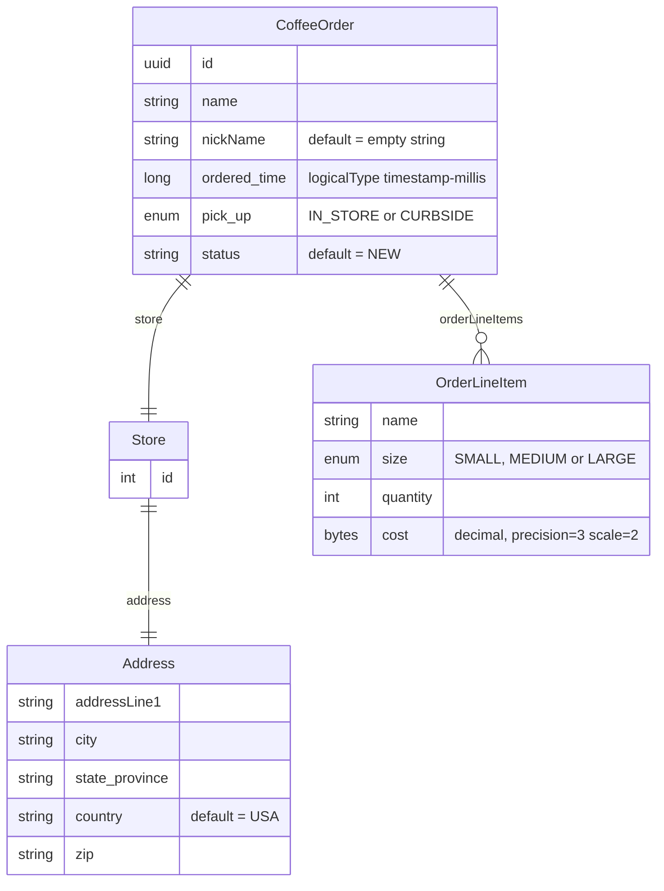
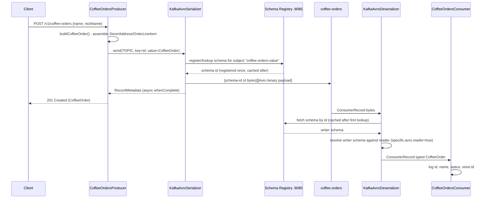

# kafka-schema-registry — Avro + Confluent Schema Registry

This module replaces the "producer and consumer each hand-roll their own JSON shape" approach used in `kafka-core` (see [`../kafka-core/README.md`](../kafka-core/README.md)) with **Avro schemas registered in a central Schema Registry**. The payoff: the registry can *reject* a schema change that would break existing consumers, instead of the break only surfacing at runtime as a deserialization failure.

For the broader repo architecture, see the [root README](../README.md).

---

## Modules

```
kafka-schema-registry/
├── schemas/                    Avro .avsc definitions + generated Java (library JAR, no Spring Boot)
├── coffee-orders-service/      REST API (port 8083) → Avro producer → "coffee-orders"
└── coffee-orders-consumer/     Avro consumer (port 8084)
```

---

## Why Avro + Schema Registry instead of JSON

With plain JSON (as in `kafka-core`), the "schema" is only ever the Java class the producer happened to serialize with `ObjectMapper`, and consumers just hope their own copy of that shape still matches. Nothing prevents a producer from renaming a field and shipping — the failure shows up as a deserialization exception (or worse, silently-wrong data) on the consumer side, in production.

Avro + Schema Registry changes the contract:

1. The **schema** (`.avsc`) is a first-class artifact, checked into version control (`schemas/src/main/avro/*.avsc` in this repo) and compiled into generated Java classes by the `avro-maven-plugin`.
2. When a producer serializes a record with `KafkaAvroSerializer`, the client library registers (or looks up) that exact schema against the Schema Registry HTTP API and prefixes the Avro-encoded bytes with a 4-byte **schema id** instead of embedding the schema itself in every message — this is what keeps individual messages small even though Avro schemas can be large.
3. Before the registry accepts a *new* version of a schema for a given subject (by default, `<topic>-value`), it checks the new schema against the previous version(s) under the subject's configured **compatibility mode**. An incompatible change is rejected at registration time — i.e., at build/deploy time for the producer — rather than discovered later as a runtime consumer failure.
4. On the consumer side, `KafkaAvroDeserializer` reads the schema id from the message, fetches (and caches) the corresponding writer schema from the registry, and reconciles it against the consumer's own compile-time reader schema using Avro's schema-resolution rules.

---

## The domain: coffee orders

All schemas live in `schemas/src/main/avro/`. `avro-maven-plugin` (configured in `schemas/pom.xml`) compiles them to `target/generated-sources/avro` at build time — nothing is hand-written or checked in under `src/main/java` for the generated classes, so `mvn clean` truly cleans them.



Two things worth calling out in the actual `.avsc` files:

- **Logical types**: `CoffeeOrder.id` is declared `{"type": "string", "logicalType": "uuid"}` and `ordered_time` is `{"type": "long", "logicalType": "timestamp-millis"}` — Avro logical types let the generated Java classes expose idiomatic `UUID` and `Instant` getters/setters (see `CoffeeOrdersProducer.buildCoffeeOrder()`, which calls `.setId(UUID.randomUUID())` and `.setOrderedTime(Instant.now())` directly) while the wire format stays a plain string/long. `OrderLineItem.cost` similarly uses a `bytes` logical `decimal` type (precision 3, scale 2) so `BigDecimal` round-trips exactly instead of losing precision through a floating-point type — the `avro-maven-plugin` config explicitly turns this on with `<enableDecimalLogicalType>true</enableDecimalLogicalType>`.
- **A separate schema not yet wired to any producer/consumer**: `CoffeeUpdateEvent.avsc` defines `{id, status}` with a `status` enum of `PROCESSING | READY_FOR_PICK_UP` — a smaller, order-status-only event shape. It compiles alongside the others but no Java code in `coffee-orders-service` / `coffee-orders-consumer` currently produces or consumes it; it's present in the schemas module as a second, independently-versioned subject (`CoffeeUpdateEvent-value` if published), illustrating that a Schema Registry instance manages compatibility **per subject**, not globally — evolving `CoffeeOrder` has no bearing on `CoffeeUpdateEvent`'s compatibility rules.

### Schema evolution and compatibility modes — how the defaults in these schemas are *already* evolution-safe

Confluent Schema Registry's default compatibility mode for a new subject is **`BACKWARD`**: a new schema version is accepted only if messages written with the *new* schema can still be read by consumers using the *previous* schema's reader — concretely, that means new fields must supply a `default`, and only fields with defaults may be dropped.

Every optional-looking field in this repo's schemas already follows that rule:

| Field | Schema | Default | Why it matters |
|---|---|---|---|
| `nickName` | `CoffeeOrder` | `""` | A future schema version could drop `nickName` and old consumers reading new-schema data (or new consumers reading old-schema data, depending on direction) still resolve a value instead of erroring |
| `status` | `CoffeeOrder` | `"NEW"` | Same — added after the fact without breaking readers that don't know about it yet |
| `country` | `Address` | `"USA"` | Same pattern one level down, inside the nested `Store.address` record |

The other compatibility modes worth knowing, for contrast (none are explicitly configured in this repo — `BACKWARD` is Confluent's registry-wide default, since no `docker-compose` here sets `SCHEMA_REGISTRY_SCHEMA_COMPATIBILITY_LEVEL` or an equivalent):

| Mode | Guarantee | Typical use |
|---|---|---|
| `BACKWARD` (default) | New schema can read data written with the previous schema | Upgrade consumers before producers |
| `FORWARD` | Previous schema can read data written with the new schema | Upgrade producers before consumers |
| `FULL` | Both of the above | Producers and consumers can upgrade in any order |
| `*_TRANSITIVE` variants | Same guarantee checked against *all* previous versions, not just the immediately preceding one | Long-lived topics with many schema revisions |
| `NONE` | No compatibility checking | Registry is purely a schema store; evolution safety is the team's responsibility |

A concrete evolution exercise you can try against this codebase: add a new required field (no `default`) to `CoffeeOrder.avsc` and rerun `mvn generate-sources` on the `schemas` module, then try to produce with it against a registry that already has the previous version registered under `BACKWARD` compatibility — the Schema Registry's REST API will reject the registration (`409 Conflict`, incompatible schema) rather than allow it, precisely because a consumer still on the old schema would have no way to fill in that field.

---

## Producer: `CoffeeOrdersProducer`

```java
private final KafkaTemplate<String, CoffeeOrder> kafkaTemplate;   // value type is the *generated Avro class*, not a String

kafkaTemplate.send(TOPIC, order.getId().toString(), order)  // key = order UUID as a String
```

`application.yml` wires the Avro serializer in for this specific `KafkaTemplate`:

```yaml
spring.kafka.producer:
  key-serializer: org.apache.kafka.common.serialization.StringSerializer
  value-serializer: io.confluent.kafka.serializers.KafkaAvroSerializer
  properties:
    schema.registry.url: http://localhost:8085
```

`POST /v1/coffee-orders` (`CoffeeOrdersProducer.CoffeeOrderRequest{name, nickName}`) builds a full `CoffeeOrder` — hardcoded `Store`/`Address`/one `Latte` `OrderLineItem` for demo purposes, real `UUID.randomUUID()` id, `Instant.now()` ordered time, `PickUp.IN_STORE`, `status = "NEW"` — and publishes it, logging the resulting partition on success via the same async `whenComplete()` pattern used in `kafka-core`.

## Consumer: `CoffeeOrdersConsumer`

```yaml
spring.kafka.consumer:
  key-deserializer: org.apache.kafka.common.serialization.StringDeserializer
  value-deserializer: io.confluent.kafka.serializers.KafkaAvroDeserializer
  properties:
    schema.registry.url: http://localhost:8085
    specific.avro.reader: true
```

`specific.avro.reader: true` is what makes `KafkaAvroDeserializer` hand the listener a fully-typed generated `CoffeeOrder` object (`record.value().getId()`, `.getStatus()`, `.getStore().getId()`, etc., as used in `CoffeeOrdersConsumer.onMessage()`) instead of the generic, reflection-only `GenericRecord` you get when this flag is left `false`.

---

## Message flow



---

## Running just this module

The root `docker-compose.yml` (repo root) runs Kafka in KRaft mode plus Schema Registry on **port 8085** — that's what both modules' `local` profile `application.yml` point at.

```bash
docker compose up -d          # from repo root
mvn spring-boot:run -pl kafka-schema-registry/coffee-orders-service     # port 8083
mvn spring-boot:run -pl kafka-schema-registry/coffee-orders-consumer    # port 8084
```

> Note: this module also ships its own standalone `kafka-schema-registry/docker-compose.yaml`, which brings up an older **Zookeeper-mode** broker (`cp-server:7.1.0` + `cp-zookeeper`) with Schema Registry on port **8081** instead of 8085. It predates the root KRaft-based compose file and is kept for reference — prefer the root `docker-compose.yml` for a consistent setup across all modules in this repo.

### Try it

```bash
curl -X POST http://localhost:8083/v1/coffee-orders \
  -H "Content-Type: application/json" \
  -d '{"name": "Ada", "nickName": "Countess"}'
```

Then watch `coffee-orders-consumer`'s logs for the `Received CoffeeOrder: id=... name='Ada' status=NEW store=1` line.

### Inspecting the registered schema

```bash
curl http://localhost:8085/subjects
curl http://localhost:8085/subjects/coffee-orders-value/versions/latest
```
