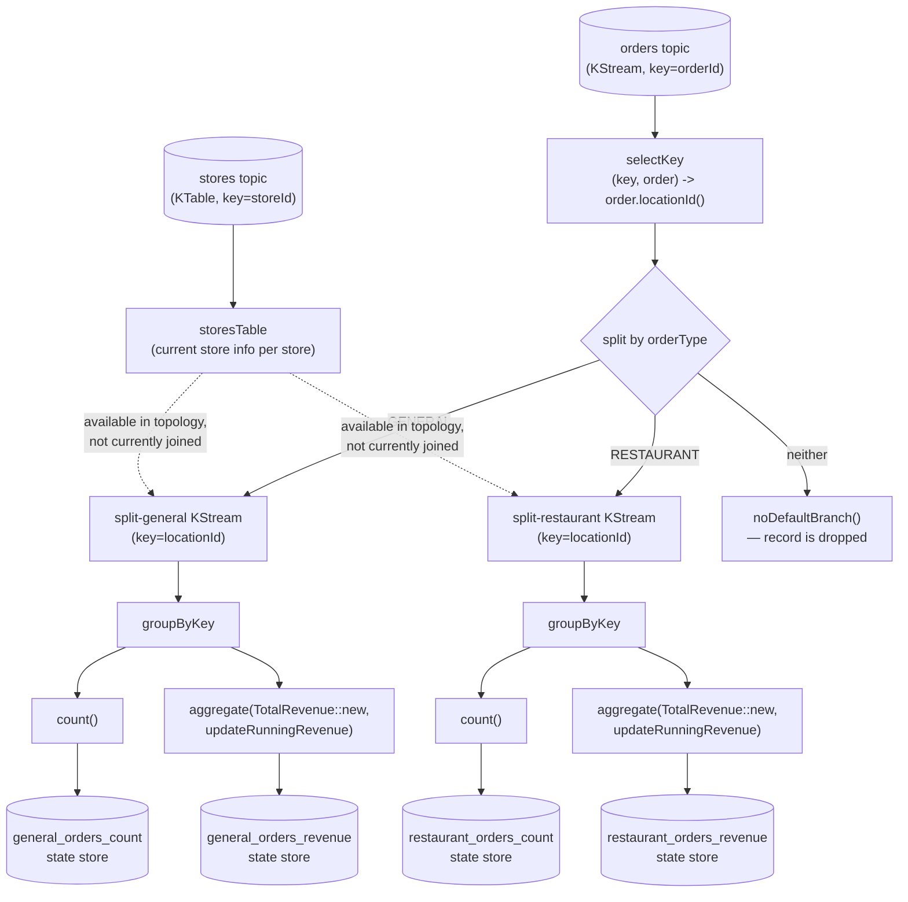

# kafka-stream — Orders Count & Revenue Topology

This module is a Kafka Streams application (`orders-streams-app`, wired via Spring Kafka's `@EnableKafkaStreams`) that continuously aggregates order counts and running revenue **per store, per order type**, materializes the results into queryable local state stores, and exposes them over a REST API for interactive queries. It's the "derive live materialized views from an event stream" half of the repo, in contrast to the request/reply style of `kafka-core` and `kafka-schema-registry`.

For the broader repo architecture, see the [root README](../README.md).

---

## Modules

```
kafka-stream/
├── orders-domain/          Shared domain records (Order, Store, TotalRevenue, DTOs) — plain JAR, no Spring Boot
└── orders-streams-app/     The topology + REST query API (port 8082)
```

`orders-domain` exists purely so the same `Order`/`Store`/`TotalRevenue` record shapes used by the topology's serdes are available to test producers (`OrdersMockDataProducer`, `StoresMockDataProducer`) and the topology test without depending on the whole Spring Boot app.

---

## Why Kafka Streams — stream processing vs. request/reply

`kafka-core`'s consumer reacts to one record at a time and writes to a database on the side. Kafka Streams instead treats the topic itself as the source of truth and continuously folds it into **state** — a `KTable` or an aggregation result — that lives inside the application (backed by RocksDB by default, changelog-replicated to Kafka for fault tolerance) and can be queried directly, with no separate database. The core abstractions this topology uses:

- **`KStream<K, V>`** — an unbounded stream of independent records (the `orders` topic: every order is a distinct event).
- **`KTable<K, V>`** — a changelog view where a new record for the same key *replaces* the previous value (the `stores` topic: a store's contact/address info is current-state-per-store, not a stream of independent events).
- **Aggregation** (`count()`, `aggregate()`) — continuously folds a `KStream`, once `groupByKey`'d, into a running per-key result, materialized as a state store.

---

## The topology, end to end (`OrdersTopology.java`)



Step by step, matching the actual code in `orderTopology()` / `aggregateOrdersCountAndRevenue()`:

1. **Consume `orders`** as a `KStream<String, Order>` keyed by `orderId`, using a custom `OrderTimeStampExtractor` — instead of Kafka's default (broker ingestion time), the stream time used for windowing/processing is pulled from `Order.orderedDateTime()` itself (falling back to `partitionTime` if the field is missing). This matters because it makes the stream's notion of "when did this happen" match business time, not "when did it arrive at the broker."
2. **`selectKey((key, order) -> order.locationId())`** — re-keys every order by store location. This is a **repartition**: Kafka Streams must write the re-keyed records to an internal repartition topic and re-read them, because `groupByKey` later requires records with the same key to be co-located on the same partition, and the original `orderId`-keyed partitioning offers no such guarantee for `locationId`.
3. **Consume `stores`** as a `KTable<String, Store>` — the current-state view of each store — with a debug `peek()` on its stream representation. This table is built and available in the topology but the aggregation branches below do not currently join against it (there's no `KTable`/`KStream` join wired into `aggregateOrdersCountAndRevenue` yet — the dashed lines in the diagram above mark that gap; enriching per-order aggregates with store address/contact info via a join would be the natural next step).
4. **`split(...).branch(...).branch(...).noDefaultBranch()`** — a single `KStream` is split into exactly two named branches, `split-general` and `split-restaurant`, based on `order.orderType()`. `noDefaultBranch()` means any order whose type is neither `GENERAL` nor `RESTAURANT` is silently dropped from further processing (there is no third catch-all branch).
5. **`aggregateOrdersCountAndRevenue(...)`** runs identically (this is the GoF Template Method referenced in the root README) for each branch:
   - `groupByKey()` — required before any aggregation; groups the already-`locationId`-keyed stream.
   - `.count()`, materialized as `<orderType>_orders_count` — a running count of orders per store.
   - `.aggregate(TotalRevenue::new, (key, order, aggregate) -> aggregate.updateRunningRevenue(key, order))`, materialized as `<orderType>_orders_revenue` — folds `order.finalAmount()` into a running `TotalRevenue(locationId, runningOrderCount, runningRevenue)` per store.

### The four materialized state stores

| Store name | Constant | Keyed by | Value |
|---|---|---|---|
| `general_orders_count` | `GENERAL_ORDERS_COUNT` | `locationId` | `Long` — running count |
| `general_orders_revenue` | `GENERAL_ORDERS_REVENUE` | `locationId` | `TotalRevenue` — running count + running `BigDecimal` revenue |
| `restaurant_orders_count` | `RESTAURANT_ORDERS_COUNT` | `locationId` | `Long` |
| `restaurant_orders_revenue` | `RESTAURANT_ORDERS_REVENUE` | `locationId` | `TotalRevenue` |

Constants also exist for windowed variants (`GENERAL_ORDERS_COUNT_WINDOWS`, `RESTAURANT_ORDERS_REVENUE_WINDOWS`, etc.) and corresponding DTOs (`OrdersCountPerStoreByWindowsDTO`, `OrdersRevenuePerStoreByWindowsDTO`) exist in `orders-domain`, but the current `orderTopology()` only builds the non-windowed count/revenue aggregations shown above — the windowed constants are declared for a future `windowedBy(...)` step that isn't wired into the topology yet.

### What `OrdersTopologyTest` actually verifies

`OrdersTopologyTest` uses `TopologyTestDriver` (an in-memory topology test harness — no broker, no Spring context) to drive the exact topology above and assert against the real state stores:

- **`countGeneralOrdersByStore`** / **`countRestaurantOrdersByStore`** — pipes 2 stores and 3 orders (2 `GENERAL` across two different stores, 1 `RESTAURANT`), then asserts `general_orders_count.get("store_1234") == 1` and `general_orders_count.get("store_4567") == 1`, and `restaurant_orders_count.get("store_1234") == 1` — confirming the branch-by-type + count-by-store aggregation lands in the correct, separate stores.
- **`revenueGeneralOrdersByStore`** / **`revenueRestaurantOrdersByStore`** — asserts the `TotalRevenue` aggregate for `store_1234` is exactly `27.00` / count `1` for general orders and `15.00` / count `1` for restaurant orders — i.e., that `finalAmount` (not a sum of line items) is what accumulates, and that general vs. restaurant revenue never leak into each other's store.
- **`multipleOrdersSameStore_accumulatesCount`** — pipes the same three orders, then pipes a *fourth* `GENERAL` order (`orderId=99999`, `finalAmount=5.00`) for `store_1234`, and asserts the count store now reads `2` and the revenue store reads `32.00` (`27.00 + 5.00`) — proving the aggregation genuinely accumulates across multiple records for the same key rather than overwriting on each new record (the behavior that would result from, e.g., accidentally using `reduce()` with last-value-wins semantics instead of `count()`/`aggregate()`).

`OrdersTopologyIntegrationTest` re-runs equivalent scenarios against a real embedded broker (`@EmbeddedKafka`) and the actual Spring-managed `StreamsBuilderFactoryBean`, confirming the topology behaves the same way when actually deployed inside the Spring Kafka Streams lifecycle rather than only under `TopologyTestDriver`.

---

## Error handling: three independent handlers for three independent failure modes

Kafka Streams distinguishes deserialization errors, in-topology processing errors, and serialization errors — each has its own pluggable handler in this module, configured in `OrdersStreamsConfiguration`:

| Failure mode | Handler | Configured behavior |
|---|---|---|
| A record fails to **deserialize** off `orders`/`stores` (bad bytes for the configured `Serde`) | `RecoveringDeserializationExceptionHandler` (Spring Kafka), delegating to a `logAndSkipRecoverer` lambda | Logs the record and exception, then skips it — the topology keeps running |
| Also present: `StreamsDeserializationErrorHandler` (a plain Kafka Streams `DeserializationExceptionHandler`) | Counts errors via an `AtomicInteger`; returns `CONTINUE` for the first 10 errors, then `FAIL` | Demonstrates a circuit-breaker-style variant: tolerate a bounded number of bad records, but stop tolerating a flood of them |
| A record fails during **topology processing** (uncaught exception in a stream operator, not deserialization) | `StreamsProcessorCustomErrorHandler` (`StreamsUncaughtExceptionHandler`, registered via `StreamsBuilderFactoryBeanConfigurer` — the Decorator pattern noted in the root README) | If the exception is a `StreamsException` whose cause's message is exactly `"Transient Error"`, returns `REPLACE_THREAD` (Kafka Streams replaces the dead stream thread and keeps the app running); any other exception returns `SHUTDOWN_APPLICATION` |
| A record fails to **serialize** on the way to an output/changelog topic | `StreamsSerializationExceptionHandler` (`ProductionExceptionHandler`, wired via `spring.kafka.streams.properties.default.serialization.exception.handler` in `application.yml`) | Always returns `CONTINUE` — logs and drops the record rather than killing the producer |

Note what this module does **not** do: unlike `library-events-consumer` in `kafka-core` (which routes unrecoverable records to an explicit `library-events.DLT` dead-letter topic), none of the handlers here publish failed records to a separate DLQ topic — every failure path in `orders-streams-app` is **log-and-skip** (or, for uncaught processing exceptions, potentially an application shutdown). There is no `orders-DLQ`/`orders.DLT` topic declared anywhere in this module's configuration. If you need replay-able failed records for this topology, adding a `DeadLetterPublishingRecoverer`-equivalent for Streams' deserialization/production handlers would be the natural extension — see `kafka-core/README.md` for what that looks like on the consumer side.

---

## Interactive queries: `OrderStoreService` + `OrdersController`

Kafka Streams' state stores are normally private to the stream-processing instance that owns their partitions. Spring's `StreamsBuilderFactoryBean` exposes the running `KafkaStreams` instance, and `OrderStoreService` uses `KafkaStreams.store(StoreQueryParameters...)` to obtain a **read-only** view of a named store directly from the JVM heap/RocksDB — no round-trip through Kafka, no separate database.

| Endpoint | Backing store | Behavior |
|---|---|---|
| `GET /v1/orders/count/{orderType}` | `general_orders_count` / `restaurant_orders_count` | All stores' counts for that order type |
| `GET /v1/orders/count/{orderType}/location/{locationId}` | same | Count for one store, `404` if absent |
| `GET /v1/orders/count/all` | both count stores | Iterates `OrderType.values()`, tagging each row with its type |
| `GET /v1/orders/revenue/{orderType}` | `general_orders_revenue` / `restaurant_orders_revenue` | All stores' running revenue for that order type |
| `GET /v1/orders/revenue/{orderType}/location/{locationId}` | same | Revenue for one store, `404` if absent |

`countStoreName(orderType)` / `revenueStoreName(orderType)` are the Strategy-pattern dispatch mentioned in the root README — they select which physical state store to query based on the `orderType` path variable, so `OrdersController` never needs to know the store names directly.

> Caveat worth knowing if you scale this app to multiple instances: `OrderStoreService.kafkaStreams()` only ever queries **local** state. With more than one instance of `orders-streams-app` running (each owning a different subset of `orders`/`stores` partitions), a query hitting an instance that doesn't own a given `locationId`'s partition will find nothing for it — a full interactive-query deployment additionally needs Kafka Streams' `allMetadataForKey()` / `KafkaStreams.metadataForKey()` to discover and forward the query to the instance that actually owns that key's partition. This module's `README` history references running two instances on different ports for exactly this reason, but the request-forwarding/proxying logic itself isn't implemented in `OrderStoreService` today.

---

## Running just this module

```bash
docker compose up -d                                              # from repo root — Kafka + Kafdrop
mvn spring-boot:run -pl kafka-stream/orders-streams-app            # port 8082
```

Feed it sample data using the test-scoped mock producers (`OrdersMockDataProducer`, `StoresMockDataProducer` under `src/test/java`), or produce manually:

```bash
docker exec -it kafka kafka-console-producer \
  --bootstrap-server localhost:9092 --topic stores \
  --property "parse.key=true" --property "key.separator=:"
# store_1234:{"locationId":"store_1234","address":{...},"contactNum":"1234567890"}

docker exec -it kafka kafka-console-producer \
  --bootstrap-server localhost:9092 --topic orders \
  --property "parse.key=true" --property "key.separator=:"
# 12345:{"orderId":12345,"locationId":"store_1234","finalAmount":27.00,"orderType":"GENERAL","orderLineItems":[...],"orderedDateTime":"2026-01-01T10:00:00"}
```

Then query:

```bash
curl http://localhost:8082/v1/orders/count/general
curl http://localhost:8082/v1/orders/revenue/general/location/store_1234
curl http://localhost:8082/v1/orders/count/all
```

### Tests

```bash
mvn test -pl kafka-stream/orders-streams-app
```

- `OrdersTopologyTest` — `TopologyTestDriver`-based, no broker required; the primary source of truth for topology behavior (see above).
- `OrdersTopologyIntegrationTest` — `@EmbeddedKafka`-based, exercises the topology through the real Spring Kafka Streams lifecycle.
- `OrdersControllerTest` — REST layer test for the interactive-query endpoints.
